<!--
  github.com/codeHannan  ·  profile README
  Place at the root of the repo named "codeHannan".
  The dashboard image is generated by .github/workflows/metrics.yml
-->

  
  
  
  

**Computer Science undergraduate** at Air University, Islamabad &nbsp;·&nbsp; Class of **2028**
 
Building toward a career in **penetration testing** &amp; offensive security.

---

<!-- ░░░ LIVE DASHBOARD — regenerated daily by GitHub Actions ░░░ -->

---

### Selected Work

**[Secure Company Network](https://github.com/codeHannan/secure-company-network-project-cisco)** — enterprise network simulation with ASA firewalls, OSPF routing and VLAN segmentation, built to study layered defense. *Cisco Packet Tracer*

**[BenchRig](https://github.com/codeHannan/benchrig)** — browser-based hardware & network diagnostics platform, no installs required. *Blazor WASM · .NET 10*

**[Art Gallery System](https://github.com/codeHannan/Art-Gallery-Management-System-CPP)** — OOP console application with role-based access control and a live auction engine. *C++*

**[Flappy Bird in Assembly](https://github.com/codeHannan/flappy-bird-assembly)** — game engine written in x86 Assembly with a hybrid Win32 GDI+ graphical build. *MASM*

---

Dashboard above is generated by <a href="https://github.com/lowlighter/metrics">lowlighter/metrics</a> and refreshes daily with live data.

